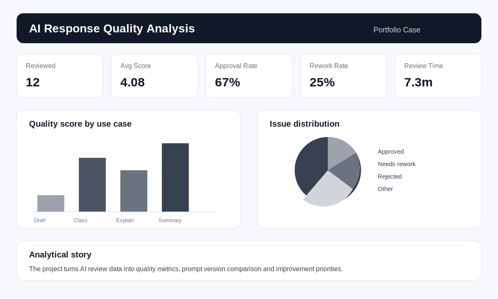

# AI Response Quality Analysis

Portfolio project focused on AI response evaluation, content curation and quality monitoring. The goal is to simulate a workflow where AI-generated answers are reviewed, classified and transformed into quality metrics for continuous improvement.

The dataset is synthetic and created only for portfolio purposes. It simulates a real AI operations scenario using Python, SQL, Power BI, evaluation criteria, prompt versioning and business recommendations.

## Business problem

A company uses AI assistants to support internal teams with summaries, classification, drafting and operational guidance. However, the business needs a structured way to evaluate answer quality, identify recurring issues and monitor whether prompt changes improve outcomes.

Main questions:

- What share of AI answers is approved without changes?
- Which issue types are most frequent?
- Which prompt version performs better?
- Which use cases have lower quality scores?
- How can the team prioritize improvements in prompts and review processes?

## Project goal

Build an analytical framework to evaluate AI responses, classify quality issues and create metrics that support prompt improvement, governance and operational decision-making.

## Skills demonstrated

- AI response evaluation and curation workflow.
- Prompt version tracking and quality comparison.
- Python for synthetic data generation and reproducible analysis.
- SQL for quality metrics, aggregations and issue analysis.
- Power BI blueprint and DAX measures for monitoring.
- Documentation of evaluation criteria, data dictionary and business rules.

## Repository structure

```text
ai-response-quality-analysis/
├── data/
│   ├── sample_prompts.csv
│   ├── sample_responses.csv
│   ├── sample_evaluations.csv
│   └── README.md
├── docs/
│   ├── business_rules.md
│   ├── dashboard_blueprint.md
│   ├── data_dictionary.md
│   └── evaluation_rubric.md
├── images/
│   └── dashboard_preview.svg
├── powerbi/
│   └── measures_dax.md
├── scripts/
│   ├── generate_ai_quality_data.py
│   └── run_sql.py
├── sql/
│   ├── 01_create_schema_duckdb.sql
│   ├── 02_data_quality_checks.sql
│   ├── 03_quality_metrics.sql
│   └── 04_prompt_version_analysis.sql
├── requirements.txt
└── README.md
```

## Evaluation dimensions

Each AI response is evaluated on five dimensions:

1. Accuracy
2. Completeness
3. Clarity
4. Tone fit
5. Actionability

The final quality score is calculated as the average of these dimensions.

## Main KPIs

- Total responses reviewed
- Average quality score
- Approval rate
- Rework rate
- Critical issue rate
- Most frequent issue type
- Quality score by use case
- Quality score by prompt version
- Average review time

## Dashboard preview



## How to run locally

1. Clone the repository:

```bash
git clone https://github.com/bruniversamente/ai-response-quality-analysis.git
cd ai-response-quality-analysis
```

2. Install dependencies:

```bash
pip install -r requirements.txt
```

3. Run the SQL scripts with DuckDB:

```bash
python scripts/run_sql.py
```

4. Generate a larger synthetic dataset if needed:

```bash
python scripts/generate_ai_quality_data.py
```

## Expected insights

This analysis helps identify:

1. Use cases with higher review effort.
2. Prompt versions with better approval rate.
3. Recurring quality issues by category.
4. Review bottlenecks and response patterns.
5. Opportunities to improve prompt structure and evaluation criteria.

## Simulated business recommendations

- Prioritize prompt improvement for use cases with low actionability and high rework.
- Create examples for issue types that appear repeatedly.
- Track quality by prompt version before and after changes.
- Use reviewer feedback to refine context, output format and acceptance criteria.
- Monitor critical issue rate as a governance indicator.

## Next steps

- Build the final Power BI `.pbix` file.
- Add a simple Python notebook for exploratory analysis.
- Add a before-and-after analysis for prompt improvements.
- Publish the case in the main portfolio website.

## Author

Bruno Nascimento  
[LinkedIn](https://linkedin.com/in/bruniversamente) | [GitHub](https://github.com/bruniversamente)
