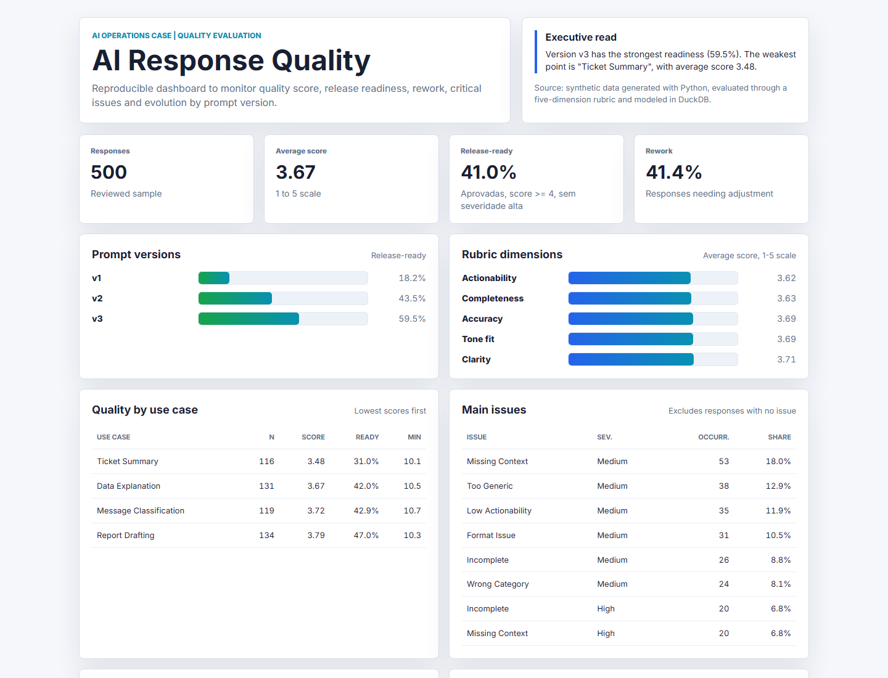

# AI Response Quality: release governance for AI outputs

[Portuguese version](README.pt-BR.md)

AI Operations case study built around a practical question: **which AI-generated responses are ready for operational use, and which still require rework, prompt changes or human review?**

The case is not about showing an average AI score. It simulates a governance workflow: review responses, apply a rubric, compare prompt versions, identify recurring failures and turn human review into a prioritized improvement backlog.

> Synthetic data created for portfolio purposes. The project simulates an AI evaluation workflow with Python, SQL, DuckDB, quality rubric, prompt versioning, data checks and a reproducible HTML dashboard.

## Executive Summary

**Core question:** are AI-generated responses good enough for operational use without meaningful rework?

**Short answer:** not yet. Only **41.0%** of reviewed responses are release-ready. Prompt version `v3` is clearly better, but the overall level of rework and critical issues still prevents unguided scale.

**Recommended decision:** use `v3` as the operational baseline, but do not fully automate the workflow yet. The safer path is to improve **Ticket Summary**, address **Missing Context**, and strengthen **Actionability** before expanding usage.

Current build highlights:

| Metric | Result |
|---|---:|
| Reviewed responses | 500 |
| Average quality score | 3.67 / 5 |
| Release-ready responses | 41.0% |
| Rework rate | 41.4% |
| Critical issue rate | 17.6% |
| Average review time | 10.4 minutes |
| Best prompt version | v3, 59.5% release-ready |
| Weakest use case | Ticket Summary, 3.48 score |
| Main issue type | Missing Context |
| Weakest rubric dimension | Actionability, 3.62 score |
| Critical data quality failures | 0 |

## Why This Case Matters

This case positions the portfolio in **applied AI with operational responsibility**. It shows that evaluating AI is not asking whether an answer "looks good"; it is defining criteria, measuring risk, comparing versions and deciding what can safely move toward production.

Interview version: "I built an evaluation layer for AI responses, found that the average score hid operational risk, and used a release-ready rule to separate usable responses from responses that still require rework."

The case demonstrates:

1. **Governance thinking:** an approved answer is not automatically ready for release.
2. **Quality measurement:** score composed from accuracy, completeness, clarity, tone fit and actionability.
3. **Improvement prioritization:** backlog by use case, prompt version and failure type.
4. **Risk reading:** critical severity affects the decision instead of being hidden inside the average.

## Dashboard

Open the static dashboard at:

```text
dashboard/ai_response_quality_dashboard.html
```

Explicit language variants are also generated:

```text
dashboard/ai_response_quality_dashboard_en.html
dashboard/ai_response_quality_dashboard_pt-BR.html
```



## Business Problem

A company uses AI assistants to support summaries, classifications, drafts and data explanations. The challenge is not only generating responses; it is knowing which responses can be trusted, which require rework and which failure types should guide prompt improvement.

Questions answered:

- What percentage of responses is ready for operational use?
- Which prompt version performs best?
- Which use cases concentrate lower quality?
- Which failure types appear most often?
- Is the weak dimension accuracy, completeness, clarity, tone or actionability?
- Are reviewers relatively calibrated?
- Are the data consistent enough to compare prompt versions?

## Analytical Read

Prompt version comparison shows clear improvement. `v1` has only **18.2%** release-ready responses and **34.0%** critical issues. `v3` reaches **59.5%** release-ready responses and reduces critical issues to **5.8%**. Prompt versioning is working, but it does not eliminate all operational risk.

The use-case read shows **Ticket Summary** as the weakest area: average score **3.48** and the lowest readiness among use cases. Operationally, that makes sense because ticket summaries require sufficient context, selection of what matters and an actionable output.

The main issue is **Missing Context**. That means part of the rework is not just "write better"; the system needs better input context, instructions and output criteria.

The weakest rubric dimension is **Actionability**. Some responses may be factually acceptable but still fail to help a user decide or act. In an operational workflow, that is a serious release risk.

## Analytical Methodology

Each response is evaluated across five dimensions:

1. `accuracy`
2. `completeness`
3. `clarity`
4. `tone_fit`
5. `actionability`

The final score is the average of the five dimensions.

A response is considered **release-ready** when:

```text
final_status = Approved
quality_score >= 4.0
severity <> High
```

This prevents a merely acceptable answer from being treated as production-ready.

## Deliverables

- `dashboard/ai_response_quality_dashboard.html`: default English dashboard.
- `dashboard/ai_response_quality_dashboard_en.html`: explicit English dashboard.
- `dashboard/ai_response_quality_dashboard_pt-BR.html`: Portuguese dashboard.
- `outputs/executive_findings.md`: English executive findings.
- `outputs/executive_findings.pt-BR.md`: Portuguese executive findings.
- `outputs/*.csv`: reviewed analytical extracts.
- `docs/`: business rules, data dictionary, dashboard blueprint and evaluation rubric.
- `scripts/`: synthetic data generation, output build and SQL runner.
- `sql/`: DuckDB queries for quality metrics and prompt version analysis.

## Skills Demonstrated

- AI Operations: response evaluation, curation, severity and improvement backlog.
- Prompt analytics: version comparison and regression/improvement read.
- SQL: aggregations, segmentation, failure distribution and improvement candidates.
- Python: synthetic data generation and reproducible output build.
- DuckDB: local analytical layer and reviewable queries.
- Data quality: missing evaluations, out-of-scale scores, duplicates and status inconsistencies.
- Storytelling: translating AI quality into release decisions.
- Visualization: portable HTML dashboard without external runtime dependencies.

## Reproduce

```bash
pip install -r requirements.txt
python scripts/build_outputs.py
python scripts/run_sql.py
```

Open:

```text
dashboard/ai_response_quality_dashboard.html
```

## Simulated Recommendations

1. Use `v3` as the operational baseline before scaling new prompt versions.
2. Prioritize `Ticket Summary`, because it combines lower average score and higher rework risk.
3. Improve `Actionability` with clearer output criteria: next action, objective summary, justification and ambiguity limits.
4. Address `Missing Context` at the source by adding input data, examples and use-case-specific instructions.
5. Separate the backlog by failure type, not only by prompt version.
6. Monitor reviewer calibration so prompt comparisons are not distorted by inconsistent human criteria.

## Method References

- [OpenAI: Evaluation best practices](https://developers.openai.com/api/docs/guides/evaluation-best-practices)
- [OpenAI: Working with evals](https://developers.openai.com/api/docs/guides/evals)
- [OpenAI: Graders](https://developers.openai.com/api/docs/guides/graders)

## Author

Bruno Nascimento  
[LinkedIn](https://linkedin.com/in/bruniversamente) | [GitHub](https://github.com/bruniversamente)
