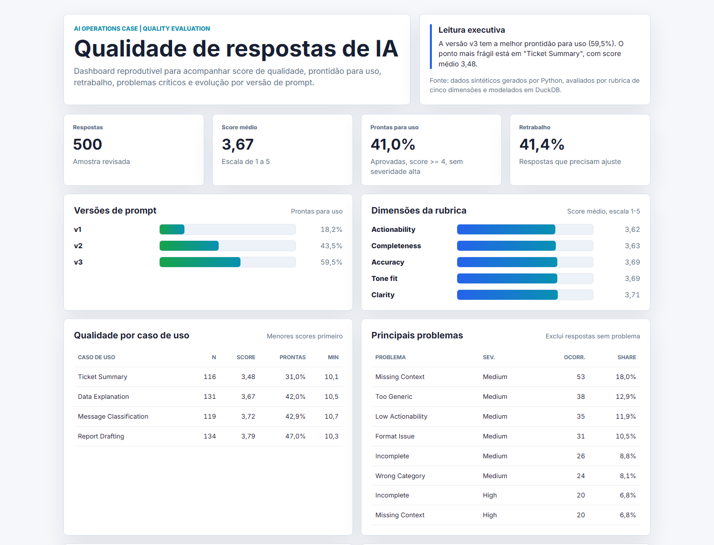

# AI Response Quality: governança de release para respostas de IA

[English version](README.md)

Estudo de caso de AI Operations para responder uma pergunta prática: **quais respostas geradas por IA estão prontas para uso operacional e quais ainda precisam de retrabalho, ajuste de prompt ou revisão humana?**

O ponto do case não é mostrar uma nota média de IA. A proposta é simular uma rotina de governança: revisar respostas, aplicar uma rubrica, comparar versões de prompt, identificar falhas recorrentes e transformar revisão humana em um backlog priorizado de melhoria.

> Dados sintéticos criados para fins de portfólio. O projeto simula uma rotina real de avaliação de IA usando Python, SQL, DuckDB, rubrica de qualidade, versionamento de prompts, checagens de dados e dashboard HTML reprodutível.

## Resumo executivo

**Pergunta central:** as respostas geradas por IA estão boas o suficiente para uso operacional sem retrabalho relevante?

**Resposta curta:** ainda não. Apenas **41,0%** das respostas revisadas estão prontas para uso. A versão `v3` é claramente superior, mas o nível geral de retrabalho e problemas críticos ainda impede uma escala sem governança.

**Decisão recomendada:** usar `v3` como baseline operacional, mas não liberar o fluxo inteiro automaticamente. O caminho mais seguro é priorizar melhoria em **Ticket Summary**, atacar problemas de **Missing Context** e reforçar critérios de **Actionability** antes de ampliar o uso.

Principais achados gerados pelo build atual:

- Respostas revisadas: **500**
- Score médio de qualidade: **3,67** em escala de 1 a 5
- Respostas prontas para uso: **41,0%**
- Taxa de retrabalho: **41,4%**
- Taxa de problema crítico: **17,6%**
- Tempo médio de revisão: **10,4 minutos**
- Melhor versão de prompt: **v3**, com **59,5%** prontas para uso
- Caso de uso mais frágil: **Ticket Summary**, com score **3,48**
- Principal tipo de problema: **Missing Context**, com **53** ocorrências médias e **20** críticas
- Dimensão mais fraca da rubrica: **Actionability**, com score **3,62**
- Falhas críticas de qualidade dos dados: **0**

## Por que este case importa no portfólio

Este é o case que posiciona o portfólio em **IA aplicada com responsabilidade operacional**. Ele mostra que avaliar IA não é perguntar se a resposta "parece boa"; é definir critérios, medir risco, comparar versões e decidir o que pode ir para produção.

Em uma entrevista, a história pode ser defendida assim: "eu construí uma camada de avaliação para respostas de IA, descobri que a média escondia risco operacional e usei uma regra de release-ready para separar respostas utilizáveis de respostas que ainda exigem retrabalho."

O case demonstra:

1. **Pensamento de governança:** uma resposta aprovada não é automaticamente pronta para release.
2. **Medição de qualidade:** score composto por accuracy, completeness, clarity, tone fit e actionability.
3. **Priorização de melhoria:** backlog por caso de uso, versão de prompt e tipo de falha.
4. **Leitura de risco:** severidade crítica entra na decisão, não fica escondida na média.

## Dashboard

O dashboard estático fica em:

```text
dashboard/ai_response_quality_dashboard_pt-BR.html
```

Ele foi pensado para leitura de recrutador e liderança: KPIs de qualidade no topo, comparação de versões de prompt, dimensões da rubrica, problemas recorrentes, tendência mensal, backlog de melhoria e calibração de revisores.



## Problema de negócio

Uma empresa usa assistentes de IA para apoiar resumos, classificações, rascunhos e explicações de dados. O desafio não é apenas gerar respostas; é saber quais respostas podem ser usadas com confiança, quais exigem retrabalho e quais tipos de falha devem orientar melhoria de prompt.

Perguntas respondidas:

- Qual percentual das respostas está pronto para uso?
- Qual versão de prompt performa melhor?
- Quais casos de uso concentram menor qualidade?
- Quais tipos de problema aparecem com mais frequência?
- A dimensão fraca é precisão, completude, clareza, tom ou acionabilidade?
- Há diferença relevante entre revisores?
- Os dados estão consistentes para comparar versões de prompt?

## Leitura analítica

A comparação por versão mostra evolução clara. A `v1` tem apenas **18,2%** de respostas prontas para uso e **34,0%** de problemas críticos. A `v3` sobe para **59,5%** de respostas prontas e reduz problemas críticos para **5,8%**. Isso indica que o versionamento de prompt está funcionando, mas ainda não resolve todo o risco.

A leitura por caso de uso mostra que **Ticket Summary** é o ponto mais frágil: score médio **3,48** e menor taxa de prontidão entre os casos de uso. Esse resultado faz sentido operacionalmente, porque resumir tickets exige contexto suficiente, seleção do que importa e saída acionável.

O principal tipo de problema é **Missing Context**. Isso sugere que parte relevante do retrabalho não depende apenas de "escrever melhor", mas de fornecer contexto, instruções e critérios de saída mais claros ao prompt.

A dimensão mais fraca da rubrica é **Actionability**. Em termos simples: algumas respostas podem até estar corretas, mas ainda não ajudam o usuário a decidir ou agir. Para uso operacional, esse é um problema crítico.

## Metodologia analítica

Cada resposta é avaliada em cinco dimensões:

1. `accuracy`
2. `completeness`
3. `clarity`
4. `tone_fit`
5. `actionability`

O score final é a média das cinco dimensões.

Uma resposta é considerada **pronta para uso** quando:

```text
final_status = Approved
quality_score >= 4.0
severity <> High
```

Essa regra evita que uma resposta apenas "aceitável" seja tratada como pronta para produção.

## Entregáveis

- `outputs/executive_findings.md`: resumo executivo em inglês.
- `outputs/executive_findings.pt-BR.md`: resumo executivo em português.

```text
ai-response-quality-analysis/
├── dashboard/
│   ├── ai_response_quality_dashboard.html
│   ├── ai_response_quality_dashboard_en.html
│   └── ai_response_quality_dashboard_pt-BR.html
├── data/
│   ├── sample_prompts.csv
│   ├── sample_responses.csv
│   ├── sample_evaluations.csv
│   └── generated/
│       ├── prompts.csv
│       ├── responses.csv
│       └── evaluations.csv
├── docs/
│   ├── business_rules.md
│   ├── dashboard_blueprint.md
│   ├── data_dictionary.md
│   └── evaluation_rubric.md
├── outputs/
│   ├── executive_findings.md
│   ├── executive_findings.pt-BR.md
│   ├── kpi_summary.csv
│   ├── prompt_version_performance.csv
│   ├── quality_by_use_case.csv
│   ├── dimension_scores.csv
│   ├── issue_distribution.csv
│   ├── monthly_quality_trend.csv
│   ├── reviewer_calibration.csv
│   ├── improvement_backlog.csv
│   ├── data_quality_summary.csv
│   └── dashboard_data.json
├── scripts/
│   ├── generate_ai_quality_data.py
│   ├── build_outputs.py
│   └── run_sql.py
├── sql/
│   ├── 01_create_schema_duckdb.sql
│   ├── 02_data_quality_checks.sql
│   ├── 03_quality_metrics.sql
│   └── 04_prompt_version_analysis.sql
└── README.md
```

## Competências demonstradas

- AI Operations: avaliação de respostas, curadoria, severidade e backlog de melhoria.
- Prompt analytics: comparação de versões e leitura de regressão/melhoria.
- SQL: agregações, segmentações, distribuição de problemas e candidatos de melhoria.
- Python: geração de dados sintéticos e build reprodutível de outputs.
- DuckDB: camada analítica local e consultas revisáveis.
- Data Quality: respostas sem avaliação, notas fora da escala, duplicidade e inconsistências de status.
- Storytelling: tradução de qualidade de IA em decisão de release.
- Visualização: dashboard HTML portátil, sem dependência externa para abrir.

## Como reproduzir

1. Instale dependências:

```bash
pip install -r requirements.txt
```

2. Gere dados, outputs e dashboard:

```bash
python scripts/build_outputs.py
```

3. Rode os SQLs principais com DuckDB:

```bash
python scripts/run_sql.py
```

4. Abra o dashboard:

```text
dashboard/ai_response_quality_dashboard_pt-BR.html
```

## Recomendações simuladas

1. Usar `v3` como referência operacional antes de escalar novas versões de prompt.
2. Priorizar `Ticket Summary`, porque combina menor score médio e maior risco de retrabalho.
3. Melhorar `Actionability` com critérios de saída mais claros: próxima ação, resumo objetivo, justificativa e limite de ambiguidade.
4. Atacar `Missing Context` na origem, adicionando dados de entrada, exemplos e instruções específicas por caso de uso.
5. Separar backlog por tipo de problema, não apenas por versão de prompt.
6. Monitorar calibração de revisores para que comparações entre prompts não sejam distorcidas por critério humano inconsistente.

## Referências de metodologia

- [OpenAI: Evaluation best practices](https://developers.openai.com/api/docs/guides/evaluation-best-practices)
- [OpenAI: Working with evals](https://developers.openai.com/api/docs/guides/evals)
- [OpenAI: Graders](https://developers.openai.com/api/docs/guides/graders)

## Autor

Bruno Nascimento  
[LinkedIn](https://linkedin.com/in/bruniversamente) | [GitHub](https://github.com/bruniversamente)
